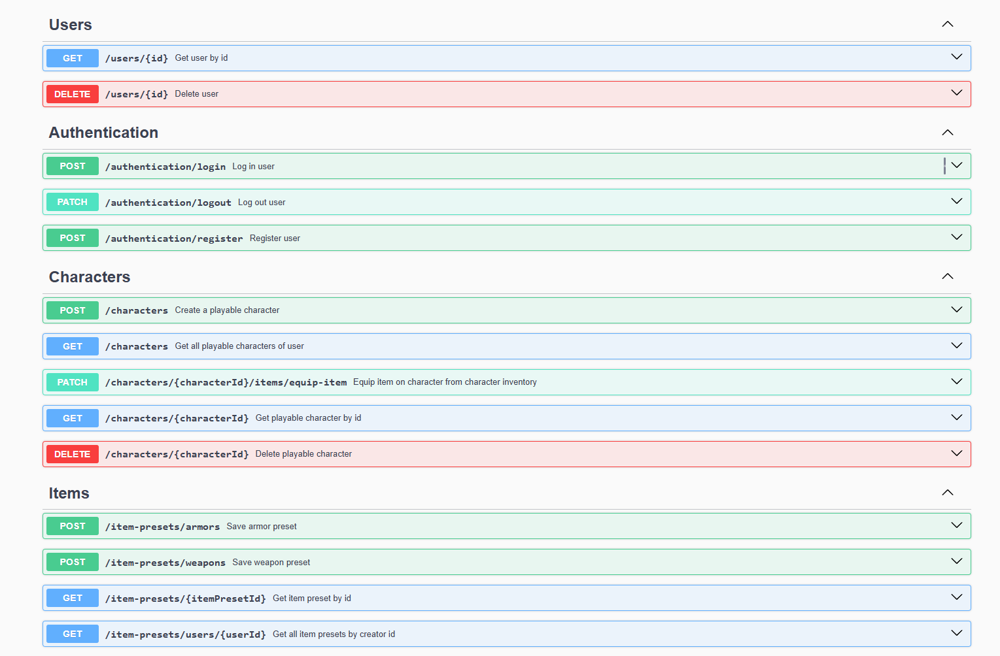

# Project Name

DndPal

# Features

Amplify your Dungeons & Dragons campaign with a party manager app designed to make TTRPGs more accessible for long-distance players. DndPal features various tools to help Dungeons Masters manage and keep track of character data. This application takes inspiration from Dungeons & Dragons tabletop ruleset, lightly following rules and calculations for mechanics like combat, making it best suited for newer players looking to familiarize themselves with the game. 

For Players:
- Create your own characters with their unique attributes.
- Manage character's inventory and equipment tabs.
- Join different parties to participate in various campaigns done by other users.
- Participate in combat and stand your ground.

For Dungeon Masters:
- Initialize a private party and invite players to join you.
- Enhance worldbuilding and storytelling by creating controllable NPCs.
- Create item presets or use ones developed by other users and provide them to party characters.
- Manage players of the party, kick any unwanted ones.
- Call for ability checks to make for a more exciting and unpredictable story.
- Initiate combat via NPCs.

General: 
- Users must create an account and authenticate before using the app.

# Project Installation
To initialize the project:
```bash
npm install
docker-compose up -d
```

To compile and run the application:
```bash 
npm start
``` 

# API Documentation
Swagger API documentation for the application will be located at:
http://localhost:3000/api



# Tools & Technologies
- **Language:** TypeScript 5.8.2
- **Framework:** NestJS 11.0.1
- **Database:** MySQL 8.0.41
- **ORM:** TypeORM 0.3.21
- **Authorization:** Passport.js 0.7.0
